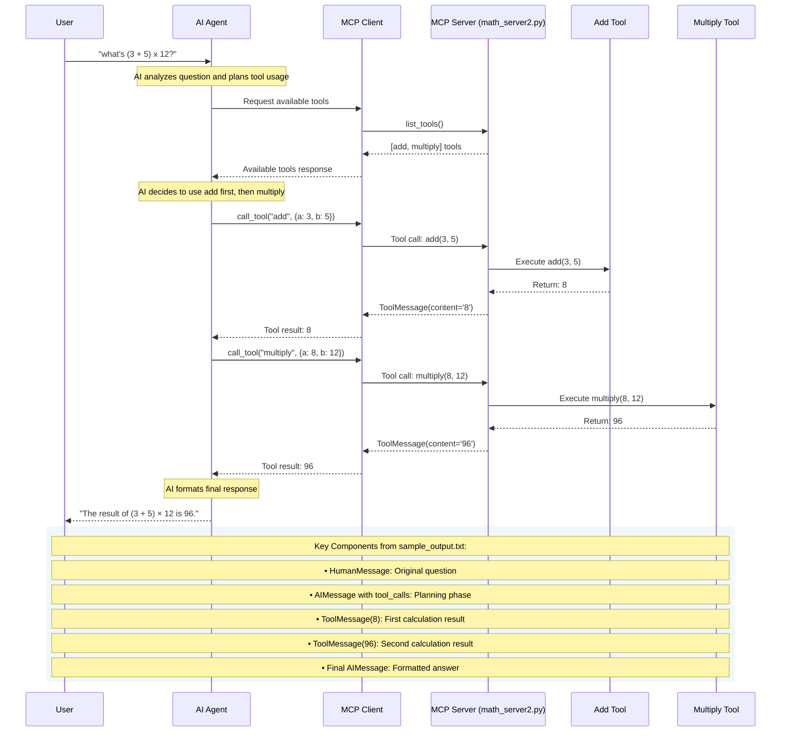

# MCP Server-Client Interaction Flow

This diagram shows the sequence of interactions between the MCP client, server, and AI agent when processing the math question "(3 + 5) x 12?".

## Flow Explanation

1. **User Query**: User asks a compound math question
2. **Tool Discovery**: AI agent discovers available math tools via MCP
3. **Sequential Execution**: 
   - First: `add(3, 5)` → returns `8`
   - Second: `multiply(8, 12)` → returns `96`
4. **Response Formation**: AI formats the final answer with proper mathematical notation

## Message Types in sample_output.txt

- **HumanMessage**: The original user question
- **AIMessage (with tool_calls)**: AI's plan to use specific tools
- **ToolMessage**: Results from each tool execution
- **Final AIMessage**: The formatted response to the user

The MCP server enables the AI to break down complex mathematical expressions into sequential tool calls, demonstrating proper order of operations.
